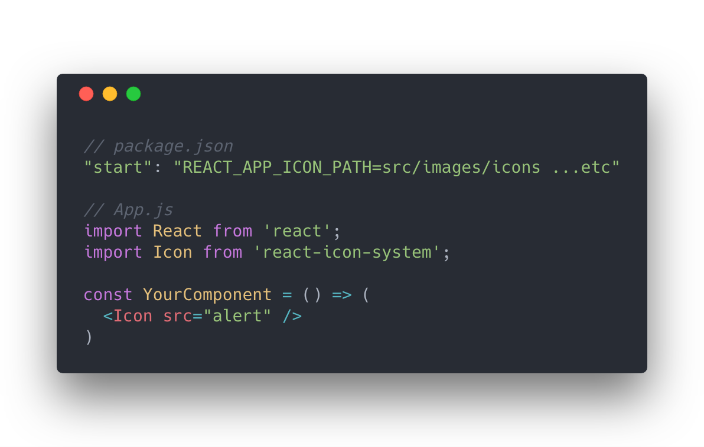

# react-icon-system

<div style="text-align: center;">
  

  
  
  
  
  
  
</div>

## Usage

### Installation

```bash
yarn add react-icon-system
```

### Example

```bash
# Folder structure example
src/
├── components/
│   └── YourComponent.js
└── images/
    └── icons/
        ├── alert.svg
        ├── info.svg
        └── warning.svg
```

```json
// package.json
"start": "REACT_APP_ICON_PATH=src/images/icons ...etc",
```

OR
```bash
# .env
REACT_APP_ICON_PATH=src/images/icons
```

```jsx
// Code
import React from 'react';
import Icon from 'react-icon-system';

const YourComponent = props => (
  <Icon src="alert" />
)
```

### Pro tips

Instead of using a static colour for your SVGs, use `currentColor`. This way you can dynamically change the icon colour by using CSS.

__Example:__
```css
.color-red {
  color: red;
}
.color-blue {
  color: blue;
}
.color-yellow {
  color: yellow;
}
```

```jsx
import React, { Fragment } from 'react';
import Icon from 'react-icon-system';

const YourComponent = props => (
  <Fragment>
    <Icon src="alert" className="color-red" />
    <Icon src="info" className="color-blue" />
    <Icon src="warning" className="color-yellow" />
  </Fragment>
)
```
